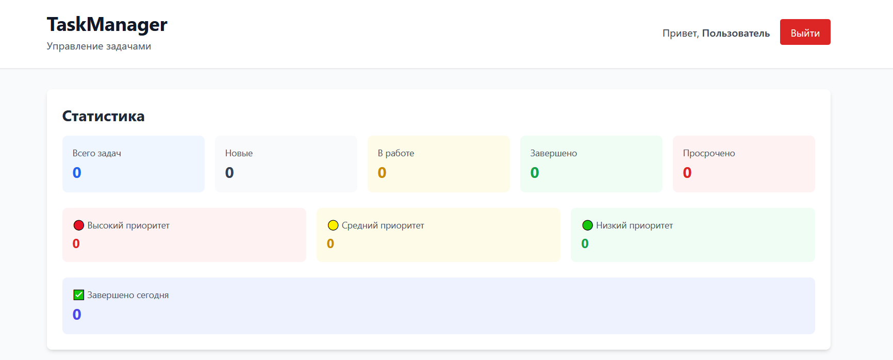
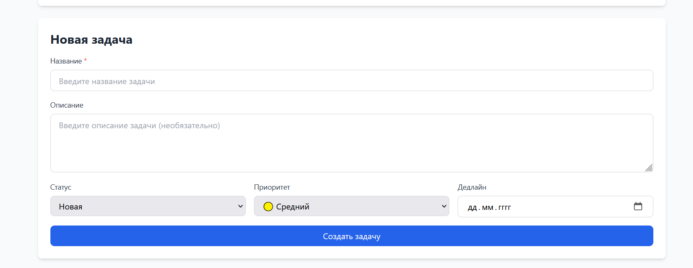
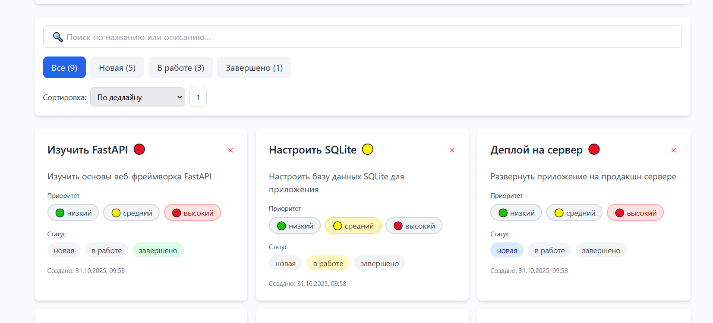
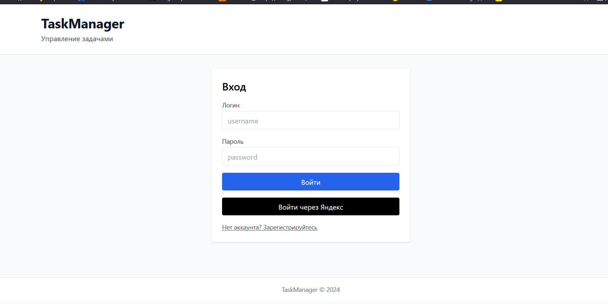
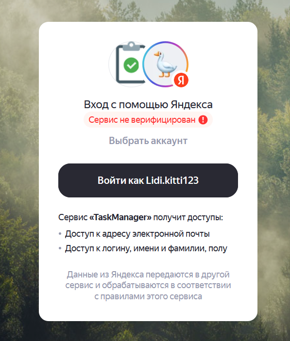
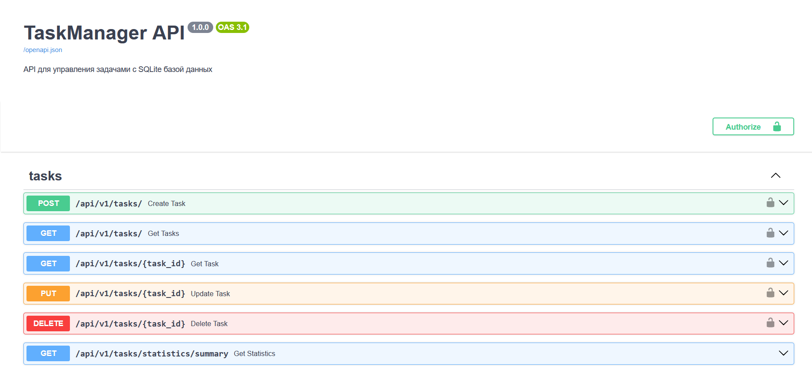

# TaskManager API

Современное веб-приложение для управления задачами с системой авторизации.

## 🚀 Основные возможности

- **Управление задачами (CRUD)**
  - Создание, просмотр, редактирование и удаление задач
  - Фильтрация по статусу и приоритету
  - Поиск по названию и описанию
  - Сортировка по различным параметрам

- **Система авторизации и аутентификации**
  - Регистрация и вход пользователей
  - JWT токены для безопасного доступа
  - Два уровня доступа: администратор и обычный пользователь
  - Интеграция с Яндекс ID для входа через OAuth

- **Безопасность и права доступа**
  - Каждый пользователь видит только свои задачи
  - Администратор имеет доступ ко всем задачам
  - Хеширование паролей с использованием bcrypt
  - Защита API endpoints через JWT токены

- **Современный стек технологий**
  - Backend: FastAPI (Python 3.11+)
  - Frontend: React + TypeScript + Vite
  - База данных: SQLite с SQLAlchemy ORM
  - Управление зависимостями: uv

## 📋 Функциональные требования

### Модель задачи
- UUID (уникальный идентификатор)
- Название (обязательное поле)
- Описание (опциональное поле)
- Статус (новая, в работе, завершено)
- Приоритет (низкий, средний, высокий)
- Срок выполнения (опционально)
- Даты создания и обновления
- Привязка к пользователю

### Модель пользователя
- UUID (уникальный идентификатор)
- Имя пользователя (уникальное)
- Хешированный пароль
- Роль (администратор или пользователь)

## 🛠 Технические требования

- **Backend:** FastAPI 0.115+
- **Frontend:** React 18+ с TypeScript и Vite
- **База данных:** SQLite с асинхронным SQLAlchemy
- **Аутентификация:** JWT токены (python-jose)
- **Хеширование паролей:** bcrypt
- **Управление зависимостями:** uv (Python) и npm (Node.js)
- **Дополнительно:** Swagger документация, Docker, переменные окружения

## 📁 Структура проекта

```
TaskManager/
├── app/
│   ├── backend/              # Backend код приложения
│   │   ├── __init__.py
│   │   ├── main.py          # Точка входа FastAPI
│   │   ├── models.py        # Pydantic модели
│   │   ├── database.py      # SQLAlchemy модели и конфигурация БД
│   │   ├── routers.py       # API роуты для задач
│   │   ├── services.py       # Бизнес-логика
│   │   └── auth.py          # Авторизация и аутентификация
│   ├── frontend/            # Frontend код приложения
│   │   ├── src/
│   │   │   ├── components/  # React компоненты
│   │   │   ├── api/         # API клиент
│   │   │   └── types/       # TypeScript типы
│   │   ├── package.json
│   │   └── vite.config.ts
│   └── scripts/             # Скрипты для работы с приложением
│       ├── run_app.py       # Скрипт запуска backend
│       ├── run_frontend.py  # Скрипт запуска frontend
│       ├── create_test_data.py  # Скрипт создания тестовых данных
│       └── run_tests.py     # Скрипт запуска тестов
├── .env                     # Переменные окружения (создать вручную)
├── .gitignore
├── pyproject.toml           # Конфигурация uv для Python
├── requirements.txt         # Python зависимости
├── uv.lock                  # Lock файл uv
├── Dockerfile               # Docker образ
├── docker-compose.yml       # Docker Compose
└── README.md                # Документация
```

## 🚀 Быстрый старт

### Предварительные требования

- Python 3.11 или выше
- Node.js 18+ и npm (для фронтенда)
- uv (менеджер пакетов Python) - опционально, можно использовать pip
- Docker (опционально)

### Установка uv (рекомендуется)

```bash
# Через pipx
pipx install uv

# Или через pip
pip install uv
```

### Шаг 1: Клонирование репозитория

```bash
git clone <repository-url>
cd TaskManager
```

### Шаг 2: Настройка переменных окружения

Создайте файл `.env` в корне проекта:

```env
# JWT настройки
TM_SECRET_KEY=your-secret-key-here-change-in-production
TM_JWT_ALG=HS256
TM_ACCESS_EXPIRE_MIN=1440

# База данных (оставьте пустым для SQLite по умолчанию)
TM_DATABASE_URL=

# Яндекс OAuth (опционально)
TM_YA_CLIENT_ID=your-yandex-client-id
TM_YA_CLIENT_SECRET=your-yandex-client-secret
TM_YA_REDIRECT_URI=http://localhost:5173
```

### Шаг 3: Установка зависимостей и запуск

**Вариант 1: Через uv (рекомендуется)**

```bash
# Установка зависимостей Python
uv sync

# Запуск backend (в одном терминале)
uv run taskmanager

# Запуск frontend (в другом терминале)
uv run taskmanager-frontend
```

**Вариант 2: Через стандартные инструменты**

```bash
# Установка зависимостей Python
pip install -r requirements.txt

# Запуск backend
python app/scripts/run_app.py

# Запуск frontend (в другом терминале)
cd app/frontend
npm install
npm run dev
```

### Шаг 4: Создание тестовых данных (опционально)

```bash
uv run python app/scripts/create_test_data.py
```

Это создаст:
- Администратора: `admin` / `admin123`
- Пользователей: `user1` / `user123` и `user2` / `user456`
- Тестовые задачи для каждого пользователя

## 📸 Скриншоты работы программы

### Главная страница



### Форма входа


### Вход через Яндекс ID (еще дорабатывается)
 

### Список задач


### Создание задачи


### Статистика


### Swagger документация


## 🔐 Система авторизации

### Роли пользователей

- **Администратор (`admin`)**
  - Полный доступ ко всем задачам в системе
  - Может просматривать, создавать, редактировать и удалять любые задачи
  - Управление пользователями (в будущем)

- **Обычный пользователь (`user`)**
  - Доступ только к своим задачам
  - Может создавать, просматривать, редактировать и удалять только свои задачи
  - Не может видеть задачи других пользователей

### Регистрация и вход

#### Обычная регистрация

```bash
curl -X POST "http://localhost:8000/api/v1/auth/register" \
     -H "Content-Type: application/json" \
     -d '{
       "username": "newuser",
       "password": "securepassword123"
     }'
```

#### Вход

```bash
curl -X POST "http://localhost:8000/api/v1/auth/login" \
     -H "Content-Type: application/x-www-form-urlencoded" \
     -d "username=admin&password=admin123"
```

Ответ содержит JWT токен:
```json
{
  "access_token": "eyJ0eXAiOiJKV1QiLCJhbGc...",
  "token_type": "bearer"
}
```

#### Вход через Яндекс ID

1. Нажмите кнопку "Войти через Яндекс" на фронтенде
2. Авторизуйтесь в Яндекс
3. Приложение автоматически создаст локального пользователя и выдаст JWT токен

## 📡 API Endpoints

### Основные эндпоинты

- `GET /` - Информация о приложении
- `GET /health` - Проверка состояния
- `GET /docs` - Swagger документация
- `GET /redoc` - ReDoc документация

### API авторизации (`/api/v1/auth`)

- `POST /register` - Регистрация нового пользователя
- `POST /login` - Вход (получение JWT токена)
- `GET /yandex/config` - Конфигурация Яндекс OAuth
- `GET /yandex/login` - URL для редиректа на Яндекс
- `POST /yandex/callback` - Callback после авторизации в Яндексе

### API задач (`/api/v1/tasks`)

**Все эндпоинты требуют авторизации (JWT токен в заголовке `Authorization: Bearer <token>`)**

- `POST /` - Создание задачи
- `GET /` - Получение списка задач (для админа - все, для пользователя - только свои)
- `GET /{task_id}` - Получение задачи по ID
- `PUT /{task_id}` - Обновление задачи
- `DELETE /{task_id}` - Удаление задачи
- `GET /statistics/summary` - Статистика задач

### Примеры запросов с авторизацией

#### Получение токена

```bash
TOKEN=$(curl -X POST "http://localhost:8000/api/v1/auth/login" \
     -H "Content-Type: application/x-www-form-urlencoded" \
     -d "username=admin&password=admin123" \
     | jq -r '.access_token')
```

#### Создание задачи

```bash
curl -X POST "http://localhost:8000/api/v1/tasks/" \
     -H "Content-Type: application/json" \
     -H "Authorization: Bearer $TOKEN" \
     -d '{
       "title": "Новая задача",
       "description": "Описание задачи",
       "status": "новая",
       "priority": "высокий"
     }'
```

#### Получение списка задач

```bash
curl "http://localhost:8000/api/v1/tasks/" \
     -H "Authorization: Bearer $TOKEN"
```

#### Фильтрация и поиск

```bash
# Фильтрация по статусу
curl "http://localhost:8000/api/v1/tasks/?status=в%20работе" \
     -H "Authorization: Bearer $TOKEN"

# Поиск по названию и описанию
curl "http://localhost:8000/api/v1/tasks/?search=задача" \
     -H "Authorization: Bearer $TOKEN"

# Сортировка
curl "http://localhost:8000/api/v1/tasks/?sort_by=created_at&sort_order=desc" \
     -H "Authorization: Bearer $TOKEN"
```

#### Обновление задачи

```bash
curl -X PUT "http://localhost:8000/api/v1/tasks/{task_id}" \
     -H "Content-Type: application/json" \
     -H "Authorization: Bearer $TOKEN" \
     -d '{
       "status": "завершено"
     }'
```

#### Получение статистики

```bash
curl "http://localhost:8000/api/v1/tasks/statistics/summary" \
     -H "Authorization: Bearer $TOKEN"
```

## 🧪 Тестирование

### Запуск тестов

```bash
# Через uv
uv run python app/scripts/run_tests.py

# Или напрямую
python -m pytest app/scripts/test_api.py -v
```

## 🐳 Запуск через Docker

### Сборка и запуск

```bash
docker-compose up --build
```

### Или только backend

```bash
docker build -t taskmanager .
docker run -p 8000:8000 --env-file .env taskmanager
```

## 🔧 Настройка Яндекс OAuth

1. Перейдите на [Яндекс ID для разработчиков](https://yandex.ru/dev/id/)
2. Зарегистрируйте новое приложение
3. Получите `client_id` и `client_secret`
4. Настройте redirect URI: `http://localhost:5173` (для разработки) - ВАЖНО: значение должно точно совпадать с тем, что вы укажете в `.env`
5. Добавьте значения в `.env`:
   ```env
   TM_YA_CLIENT_ID=ваш_client_id
   TM_YA_CLIENT_SECRET=ваш_client_secret
   TM_YA_REDIRECT_URI=http://localhost:5173
   ```

## 📊 Мониторинг и доступ

- **Backend API:** http://localhost:8000
- **Frontend приложение:** http://localhost:5173
- **Swagger документация:** http://localhost:8000/docs
- **ReDoc документация:** http://localhost:8000/redoc
- **Проверка состояния:** http://localhost:8000/health

## 🔍 Решение проблем

### Проблемы с зависимостями

1. **Обновите uv:**
   ```bash
   pip install --upgrade uv
   ```

2. **Переустановите зависимости:**
   ```bash
   uv sync --refresh
   ```

### Проблемы с базой данных

Если база данных повреждена или нужно начать заново:

```bash
# Удалите старую базу данных
rm taskmanager.db

# Перезапустите приложение (база создастся автоматически)
uv run taskmanager
```

### Проблемы с npm/frontend

```bash
cd app/frontend
rm -rf node_modules
npm install
npm run dev
```

### Проблемы с кодировкой (Windows)

Если видите кракозябры в терминале, убедитесь, что используете UTF-8:

```powershell
[Console]::OutputEncoding = [System.Text.Encoding]::UTF8
```

## 🤝 Разработка

### Добавление новых эндпоинтов

1. Создайте модель в `app/backend/models.py`
2. Добавьте бизнес-логику в `app/backend/services.py`
3. Создайте роут в `app/backend/routers.py` или `app/backend/auth.py`
4. Добавьте зависимость `get_current_user` для защиты эндпоинта
5. Добавьте тесты в `app/scripts/test_api.py`

### Структура кода

- **Модели** (`models.py`) - Pydantic модели для валидации данных
- **База данных** (`database.py`) - SQLAlchemy модели и конфигурация
- **Сервисы** (`services.py`) - Бизнес-логика приложения
- **Роутеры** (`routers.py`, `auth.py`) - HTTP обработчики запросов
- **Frontend** (`app/frontend/`) - React компоненты и API клиент

## 📝 Лицензия

[Указать лицензию]

## 👥 Авторы

[Указать авторов проекта]
